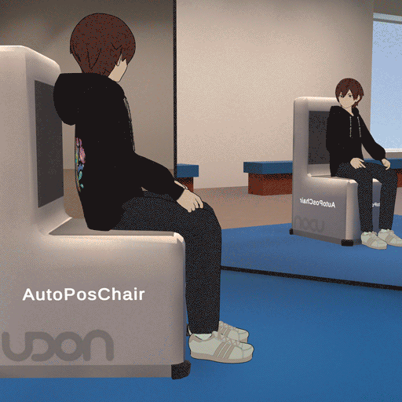
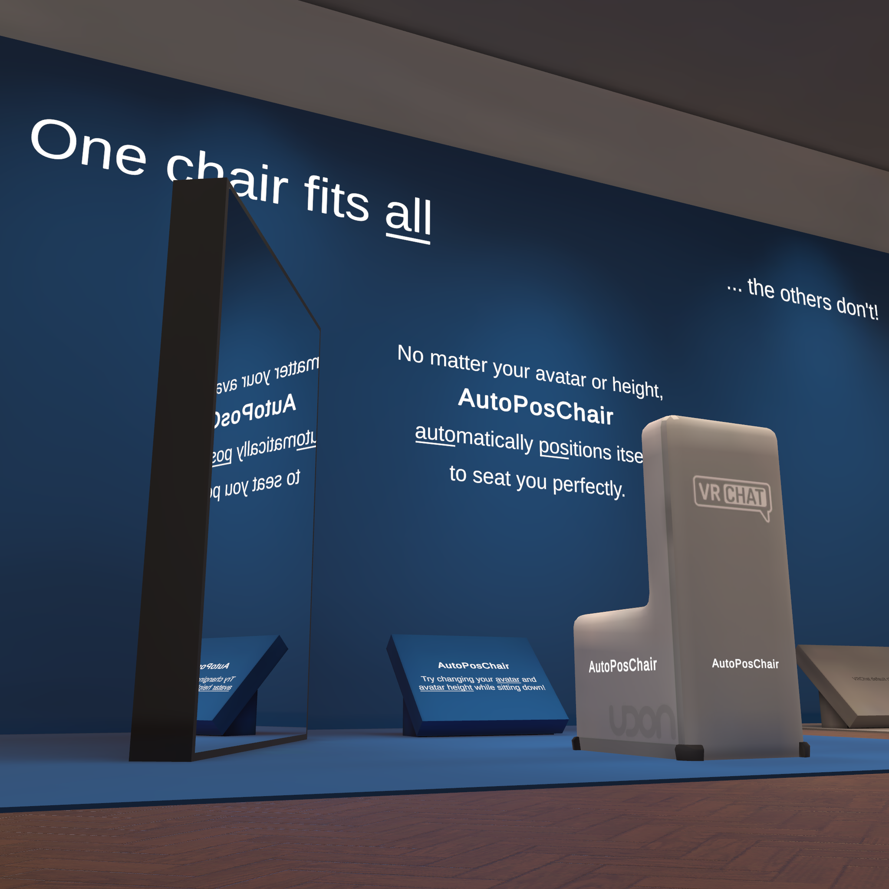
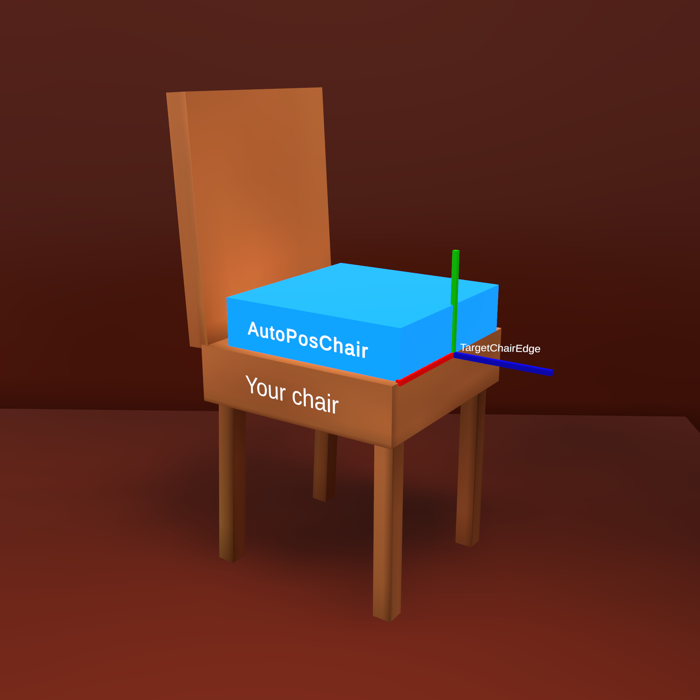
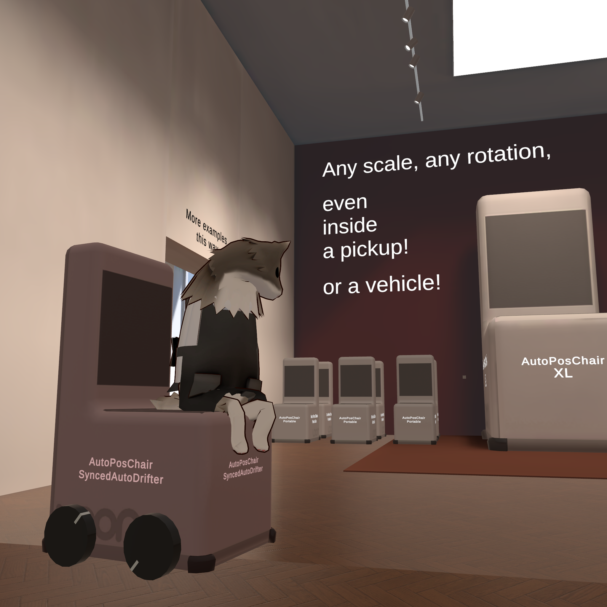
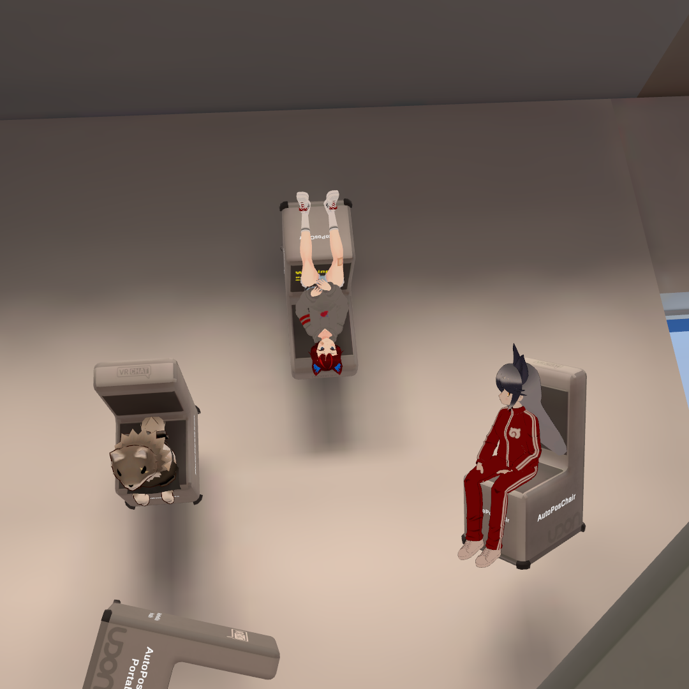

# **AutoPosChair**

A Prefab for VRChat SDK 3 Worlds

By Uzer Tekton




------------------------------------------------------------------------

### Download

Go to Releases page to download: https://github.com/UzerTekton/AutoPosChair/releases

Please note: in-game attribution is required. `AutoPosChair 1.1.0 by Uzer Tekton (MIT License)`

>#### Support me
>
>Please donate! I need financial support, every little helps!
>
>PayPal donation link: https://www.paypal.com/donate/?hosted_button_id=6TTCQN6MDSQHJ
>
>BOOTH shop page: https://uzertekton.booth.pm/


------------------------------------------------------------------------

### Table of contents

- [Download](#download)
- [Table of contents](#table-of-contents)
- [About](#about)
  - [Visit the demo world in VRChat!](#visit-the-demo-world-in-vrchat)
  - [Features](#features)
- [Usage](#usage)
  - [Basic method (for beginners)](#basic-method-for-beginners)
  - [Making your own chair container Prefab (preferred method)](#making-your-own-chair-container-prefab-preferred-method)
  - [Advanced customization (optional)](#advanced-customization-optional)
- [Technical notes](#technical-notes)
- [Version history](#version-history)
- [Contact](#contact)
  - [Support me](#support-me)
- [Special thanks](#special-thanks)
- [License](#license)


------------------------------------------------------------------------

### About

Universal solution for properly sitting chairs in all VRChat worlds.

Use this to fix the problem of default VRC Station not positioning avatars correctly.

This Prefab is essentially an interactive trigger that you place on top of your own chair or anywhere you want to sit down. It automatically adjusts the sitting position to make it look correct for most if not all avatars.

A chair that just works! Just like it should.

The hope is that this opens up entirely new possibilities for world design in VRChat.


#### Visit the demo world in VRChat!

Search for the world `AutoPosChair Demo` in-game.

Or use link: https://vrchat.com/home/launch?worldId=wrld_48f36aca-2f89-4766-be6f-e8122ac2c2de




#### Features

- Easy to use, all you need to do is place an instance of the Prefab on top of your own chair model.
- One chair fits all avatars:
  - All heights and sizes and body proportions
  - Different sitting poses (e.g. cross-legged)
  - Strange avatars with no legs or non-proportional legs
- The chair works in all situations:
  - Changing avatar while seated
  - Changing avatar height while seated
  - Rotated chair of any angle in world space
  - Scaled chair of any scale in world space
  - In a VRC Pickup e.g. being thrown
  - In a moving object e.g. a vehicle
- Other features:
  - Works in VR
  - Custom proximity detection to prevent entering chair from afar
  - Minimal performance impact, even with large number of chairs
  - Minimal network usage
  - Works with avatar culling
  - Works with late joiners
  - Smooth adjustment motion
  - In-game error log output
  - Fully commented Udon Graph


------------------------------------------------------------------------

### Usage



Visit the demo world for a visual guide! Search for the world `AutoPosChair Demo` in-game.

- Prerequisite: Have VRChat SDK 3 installed. Use VCC to install if in doubt.
- Import the package (drag and drop into your Assets window). You will need:
```
AutoPosChair (Prefab)
AutoPosChairCalibrator (Udon Graph)
AutoPosChairProximityChecker (Udon Graph)
```
- Put these somewhere in your Assets folder, e.g. inside `Assets/Prefabs/AutoPosChair/`


#### Basic method (for beginners)

- Use this method only if you want something done quickly and easily, and only for a few chairs. The preferred method is to put it inside your own Prefab (see later section).
- Drag and drop an instance of the Prefab `AutoPosChair` into your scene, then position it on top of your chair seat.
    - By default, the pivot position of the Prefab is the center point of a 40 x 40 cm area on your sitting surface (such as a chair seat). Therefore the Prefab position should be 0.2 m horizontally offset backwards from the front edge of your chair.
    - The Prefab height position (Y) is the height of your sitting surface from the floor, a height of 0.5 m (typical for a dining chair) is a good starting point.
    - You don't need to be super precise. You can just eyeball it and then adjust the position if necessary.
- Load up the game and it should work now.


#### Making your own chair container Prefab (preferred method)

- Use this method to maintain consistency across all chairs of the same type.
- The basic idea is to make a Prefab with have an empty GameObject as parent, and put your own chair model and AutoPosChair alongside each other inside it.
- Avoid non-uniform scaling. While it could still work, Unity does not like non-uniform scaling with rotations and it may create unpredictable results.
- Avoid changing the internal hierarchy of the Prefab because it may create unpredictable results.
- An example using the recommended structure:
```
YourDiningChair (Your own Prefab, empty GameObject, zero transform and uniform scale.)
├── YourDiningChairModel (Your own chair model.)
└── AutoPosChair (Positioned above the seating surface.)
```
-  Once you have made such a Prefab, you can then place any number of instances of this chair into your world.


#### Advanced customization (optional)

- This can be done either via Instance Overrides inside a chair Prefab (e.g. just start changing things inside YourDiningChair), or Prefab Variants if you are managing many different types of chairs with some shared Overrides between types.
- Modify the children objects inside `AutoPosChair` to customize your chair.
  - `BoxForInteraction`: You can change the interaction trigger to any shape you want by changing the Box Collider component. Default a 40 x 40 x 10 cm box.
    - For example, to make the whole chair clickable, replacing the Box Collider with a chair shaped Mesh Collider (and add a Mesh Renderer) as the trigger. It is recommended to keep `AutoPosChair` independent from the actual chair model, and use a duplicate Mesh Collider (and Mesh Filter) as the trigger. This is because:
      - Objects marked as static will not get highlighted when mouseover. But objects not marked as static will not get baked lighting. Best keep them independent.
      - If you place any other object (such as the chair model) as a child under `BoxForInteraction`, the whole chair would get highlighted when mouseover (unless marked as static), while only the invisible box is clickable, which is visually inconsistent and confusing.
  - `SphereForProximityCheck`: You can adjust how far away you want the chair to become interactable. Default 2 m radius.
  - `StationEnter`: No need to touch this, this is controlled by the script.
  - `StationExit`: You can position this to a more sensible place for your particular chair, for example on the floor on the left or right side of a booth seating or dining chair (IRL you wouldn't stand on the table), or behind the chair if you are sitting on a cliff (to prevent falling).
  - `TargetChairEdge`: This is the reference position the script looks at for calculations. You can adjust its local position (but not local rotation) to precisely align with the edge of whatever surface you are sitting on. This will affect the final sitting position.
    - When placed correctly, `TargetChairEdge` Z axis should point in the direction the chair is facing. Y axis should be perpendicular (upwards) to the seating surface. X axis should align with the actual chair edge.
    - `TargetChairEdge` local rotations must be 0,0,0 for calibration to work properly. If you want a rotated chair, you can rotate the parent objects (`AutoPosChair` or its parents), but not the `TargetChairEdge` itself locally.


------------------------------------------------------------------------

### Technical notes



- Made with Udon Graph in Unity 2022.3.22f1 with VRChat SDK Worlds 3.7.5
- The underlying principle is similar to UdonCalibratingChairs 4.0 by Superbstingray, but with a completely new algorithm and calibration process.
- The basic idea is adjusting the position of the StationEnter, so that the avatar looks like it is sitting correctly while inside the VRC Station.
- The transform calculation is based on the front edge of the chair.
  - The script estimates there the chair edge should be by taking into account an assumed thigh thickness ratio and overhang ratio in relation to the UpperLeg bones lengths. The default ratios are tested to look correct for most avatars.
  - The transform method keeps the player perfectly centered from left to right (i.e. no X axis or sideways movement).
- Calibration cycles loop until the transform is completed within a tolerance distance, with a safety timeout period (default 10 seconds).
- The calibration only runs when someone sits down, so there is minimal performance impact, even with a large number of chairs.
- The only network usage is one final sync of the final position fired by the sitting down player when their own calibration is completed. This allows late joiners to use the most accurate results from the owner (who had already completed calibration prior), and for avatars beyond the culling distance to update position correctly using owner's data, because Udon cannot detect whether an avatar is culled (by culling distance), and calibrating with a culled avatar will create inaccurate results.
  - The alternative strategy of doing everything locally (such as the case of UCC 4.0) requires waiting for the remote player to get within a certain range before calibrating. However, there is no way in Udon to tell whether an avatar is culled, nor detect the culling distance settings. Because the culling distance can vary from player to player, if we were to simply assume a calibration range for everyone, it is very easy to have calibrations done on a culled avatar, or have unculled avatar in the distance waiting for calibration while looking weird.
  - This script would instead calibrate remote players regardless of distance, and have the final correct position synced to everyone by the person sitting down, who should always have the most accurate avatar model for calibration and unaffected by any culling. This will ensure even the culled avatars have the correct position, and no avatar is left uncalibrated in the distance.
  - Since it is only one Vector3 variable, synced only one time per sitting down (or adjusting heights etc.), the network usage is minimal and inconsequential in the grand scheme of things.
- The script reacts to avatar changes and avatar eye height changes while being seated, and restarts calibration automatically.
- The script uses a fallback method for strange avatars that do not have conventional bone structures or are grossly over-sized, and puts them directly on top the chair (like a plushie) to look correct. Try using VRCat or VRRat.
- Some functions such as disabling tooltip and VR fix for rotated stations are based on UCC 4.0 by Superbstingray.
- The Prefab is designed based on a typical dining chair with an IRL seating height of 50 cm from the floor, and the VRChat assumption of the player collider being a 40 cm diameter 165 cm tall capsule. The 40 x 40 x 10 cm box is optimal for visual legibility and clickability from all view angles. In other words, the Prefab conforms to the same assumptions of the default VRChat animations and poses, and is designed to be user-friendly.
- Proximity checking uses a sphere collider for realism and performance reasons. The default radius is 2 m measured at eye level (correspondingly 1 m above the seating surface, or 1.5 m from the floor). Beware that this radius could be affected by scaling.
- A simple usage example can be found in the Examples folder. It shows the recommended structure for making your own chair. The AutoPosChair Prefab doesn't need the Examples folder to function, you can safely delete the folder to save space.
- By default "Can use station from station" is turned off. This is because there is currently a bug with VRC Station when entering station from another station, the camera view angle limits will be messed up. This is a bug of the VRC component itself and can only be fixed by VRChat devs.


------------------------------------------------------------------------

### Version history

#### AutoPosChair 1.1.1

2025-06-05

  - Patched the null exception bug when the prefab cannot find a parent object.

#### AutoPosChair 1.1.0

2025-02-28

  - All remote players including late joiners will now always prioritize results from the owner. Culled avatars should now always position correctly.

> **Note**: 2025-06-04 Bug and workaround: If the prefab `AutoPosChair` is placed directly into the scene with no parent object, the script will crash due to a `Debug.Log` trying to find the name of a parent GameObject but got `null` because there is no parent object.
>   - To fix this, place the `AutoPosChair` prefab under an empty GameObject parent. (Recommended method)
>   - Alternatively, go into `AutoPosChairCalibrator` Udon Graph, near the top left area of the graph, there is two links going from the "Trying to get chair identity" area, one going to "Log player name when they enter", another going to "Log player name when they exit". Delete these two connections. (If you really must place the prefab without a parent GameObject)
>   - 2025-06-05: This bug is patched in 1.1.1.

#### AutoPosChair 1.0.0

2025-02-27

  - Initial release


------------------------------------------------------------------------

### Contact

Leave a message on my Discord server or DM me: https://discord.gg/yG4HnBM8Du


#### Support me

Please donate! I need financial support, every little helps!

PayPal donation link: https://www.paypal.com/donate/?hosted_button_id=6TTCQN6MDSQHJ

BOOTH shop page: https://uzertekton.booth.pm/


-------------

### Special thanks

Some non-substantial parts are a derivative of UdonCalibratingChairs 4.0 by Superbstingray (MIT License).

Thank you for helping with testing and feedback and encouragement!




------------------------------------------------------------------------

### License

AutoPosChair is available under the MIT License with an additional condition:

For use of this Prefab in a VRChat world, an in-game attribution is required, by including the asset title, the version used, author name, and type of license.

`AutoPosChair 1.1.0 by Uzer Tekton (MIT License)`

