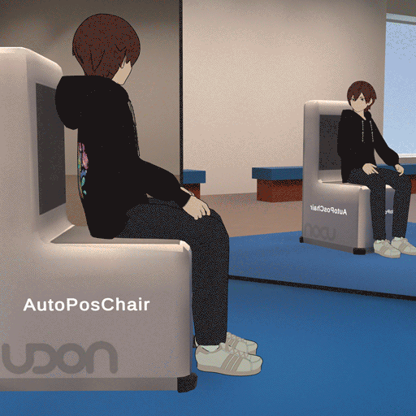
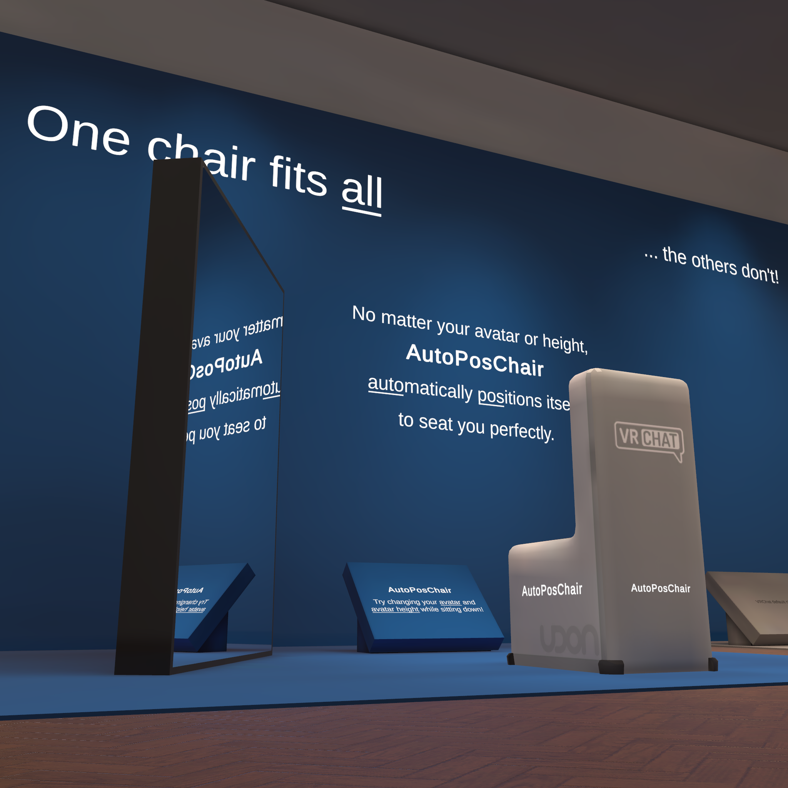
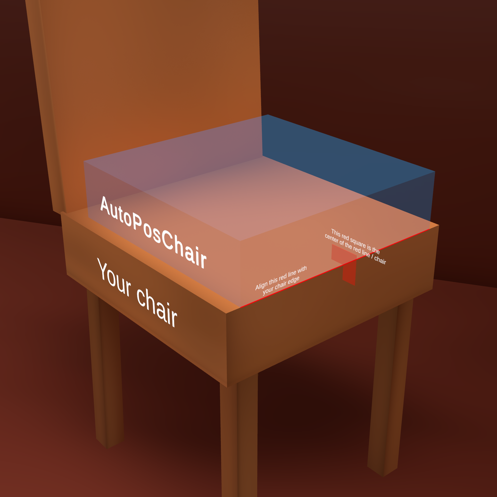
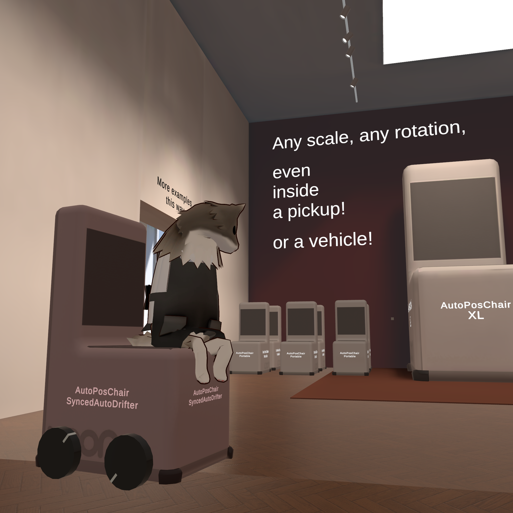
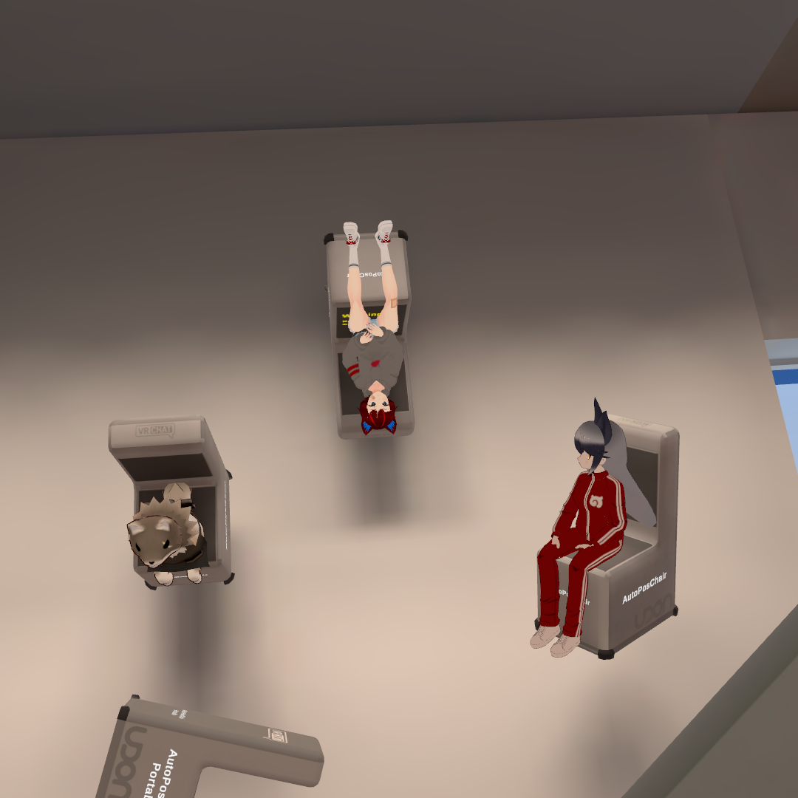

# **AutoPosChair**

A prefab for VRChat SDK 3 Worlds

By Uzer Tekton




------------------------------------------------------------------------

### Download

Download latest version prefab (2.0.0): https://github.com/UzerTekton/AutoPosChair/releases

To use this in your world, please show credit: `AutoPosChair 2.0.0 by Uzer Tekton (MIT License)`

>#### Please donate to support this project:
>
>PayPal donation: https://www.paypal.com/donate/?hosted_button_id=6TTCQN6MDSQHJ
>
>BOOTH shop: https://uzertekton.booth.pm/


------------------------------------------------------------------------

### Table of contents

- [Download](#download)
- [Table of contents](#table-of-contents)
- [About](#about)
  - [Visit the demo world in VRChat!](#visit-the-demo-world-in-vrchat)
  - [Features](#features)
- [Usage](#usage)
  - [Basic method (for beginners)](#basic-method-for-beginners)
  - [Prefab method (preferred method)](#prefab-method-preferred-method)
  - [Advanced customization (optional)](#advanced-customization-optional)
- [Technical notes](#technical-notes)
- [Version history](#version-history)
- [Contact](#contact)
  - [Support this project](#support-this-project)
- [Special thanks](#special-thanks)
- [License](#license)


------------------------------------------------------------------------

### About

Universal solution to fix VRC Station not positioning avatars correctly.

This prefab can be placed on a chair model or anywhere in the scene. When clicked, it automatically adjusts the station position to make it look correct for most avatars.

A chair that just works! Just like it should.

The hope is that this opens up entirely new possibilities for world design in VRChat.


#### Visit the demo world in VRChat!

Search for the world `AutoPosChair Demo` in-game.

Or use link: https://vrchat.com/home/launch?worldId=wrld_48f36aca-2f89-4766-be6f-e8122ac2c2de




#### Features

- Easy to use, simply place an instance of the prefab on top of your own chair.
- One chair fits all avatars:
  - All heights and sizes and body proportions
  - Different sitting poses (e.g. cross-legged)
  - Non-humanoid avatars with no legs or non-proportional legs
- The chair works in all situations:
  - Changing avatar while seated
  - Changing avatar height while seated
  - Rotated chair of any angle in world space
  - Scaled chair of any scale (uniform scale) in world space
  - In a VRC Pickup, sit down and remain seated while being thrown
  - In a moving object like a vehicle
- Other features:
  - Written in U# and optimized for performance
  - Minimal performance impact even with large number of chairs
  - Minimal network usage, only one manually synced variable
  - Works with avatar culling
  - Works with late joiners
  - Smooth adjustment motion using an in-house SpringDamp
  - In-game error log output that can be turned off
  - Includes a custom inspector in Editor with automatic checks and repair.


------------------------------------------------------------------------

### Usage



> Visit the demo world to test this chair! Search for the world `AutoPosChair Demo` in-game.

- Prerequisites: 
  - VRChat SDK 3.10.1 or newer (Use VCC to update if in doubt)
  - Unity 2022.3.22f1 (other versions are untested)

- Import the package (drag and drop into your Assets window). You will need:
```
AutoPosChair.prefab (Prefab)
Scripts/AutoPosChair.cs (Mono Script)
Scripts/AutoPosChair.asset (Udon Sharp Program Asset)
```
- Put these somewhere in your Assets folder, e.g. inside `Assets/Prefabs/AutoPosChair/`


#### Basic method (for beginners)

- Use this method only if you want something done quickly and easily, and only for a few chairs. Otherwise, use the prefab method in the next section.
- Drag and drop an instance of the prefab `AutoPosChair` into your scene.
- Position `AutoPosChair` on top of your chair seat.
    - The red line is a gizmo to help visually align to your chair edge.
      - The red square in the middle is the center point.
    - By default the prefab represents a 40 x 40 cm sitting area, therefore the prefab position should normally be at `0.2` Z distance away from the front chair edge.
    - The Y position is the height of your sitting surface. Use Y `0.5` for a typical dining chair.
- Done! Test and fine-tune the position if needed.


#### Prefab method (preferred method)

- Use this method to maintain consistency across all copies of a chair in your scene. For example, a room with several dining chairs, or a theater with many seats.
- Make a prefab using an empty GameObject as container:
```
YourDiningChair (Empty GameObject, zero transform and uniform scale)
├── YourDiningChairModel (Your own chair model)
└── AutoPosChair (Positioned above the seating surface)
```
- Inside `YourDiningChair`, move and scale the model `YourDiningChairModel` in anyway you like.

- Inside `YourDiningChair`, move `AutoPosChair` so that the red line gizmo is visually aligned to your chair edge.

- Your `YourDiningChair` prefab is now ready, you can place any amount of instances of it into your scene and move them around (either at root or inside a parent GameObject).
  - It is recommended to keep `YourDiningChair` at a scale of `(1,1,1)`, or any uniform scale (same numbers of X Y Z), such as `(3,3,3)` if you want a giant chair.
    - Avoid non-uniform scaling. Generally speaking, non-uniform scaling can create unpredictable results due to inherent limitations of Unity (`Transform.lossyScale`).
    - If `YourDiningChair` is inside another parent GameObject, be careful of any non-uniform scale that it can inherit. 

- Repeat the above steps and create different prefabs for different types of seats. For example, you can have a prefab for dining chairs, another for garden benches, and another for large sofas, and so on.


#### Advanced customization (optional)

- This can be done by editing the `AutoPosChair` prefab directly, or via Instance Overrides inside a chair Prefab (e.g. just start changing things inside `YourDiningChair`), or via Prefab Variants if you are managing many different types of chairs with some shared Overrides between types.
- Objects inside the `AutoPosChair` prefab:
  - `AutoPosChair`: This top level container hosts the trigger Collider for interaction. The default is a 40 x 40 x 10 cm Box Collider. You can edit this to change the shape of interaction highlight
    - For example, to make the whole chair clickable, replacing the Box Collider with a chair shaped Mesh Collider as the trigger. It is recommended to keep `AutoPosChair` independent from the actual chair model, therefore use a duplicate Mesh Collider (and Mesh Filter) as the trigger. This is because:
      - Objects marked as static will not get highlighted when mouseover. Objects not marked as static will also not get baked lighting.
      - The trigger `AutoPosChair` (non-static) and the model `YourDiningChairModel` (static) are separate objects for this reason.
      - If you place any other object (such as the chair model) as a child under `AutoPosChair`, the whole chair would get highlighted when mouseover while only the invisible box is clickable, which is visually inconsistent and confusing.
      - While the Collider can be at any Size or Center position, it cannot have a rotation indepedantly, if you want to rotate, you have to rotate the `AutoPosChair` prefab in the `YourDiningChair` local space (or world space).
  - `StationEnter`: No need to touch this, its Transform is controlled by the script. It should share the same parent as `ChairEdge` but the script will automatically fix this.
  - `StationExit`: You can manually position this to a more sensible place for your particular chair, for example on the floor on the left or right side of a booth seating or dining chair (IRL you wouldn't stand on the table), or behind the chair if you are sitting on a cliff (to prevent falling upon exit).
  - `ChairEdge`: This is the reference Transform the script uses to calculate the correct sitting position. You can reposition it to align with the edge of whatever surface you are sitting on.
    - When placed correctly, `ChairEdge` Z axis should point in the direction the chair is facing. Y axis should be perpendicular (upwards) to the seating surface. X axis, highlighted by the red line, should align with the chair edge visually.
    - The `ChairEdge` rotation does not matter, the script will automatically reset it to `(0, 0, 0)` in local space. This is because calibration happens along the Y and Z axis of the`AutoPosChair`local space. If you want to change the orientation of the sitting player, you have to rotate the `AutoPosChair` prefab as a whole.


------------------------------------------------------------------------

### Technical notes



- Starting with version 2.0.0 it has been completely rewritten in U#. In previous versions 1.x.x it was in Udon Graph.
- The underlying principle is inspired by UdonCalibratingChairs 4.0 by Superbstingray, but with a completely new algorithm and calibration process.
- The basic idea is adjusting the position of the StationEnter, so that the avatar looks like it is sitting correctly while inside the VRC Station.
- The calibration method is done in several steps:
  - Calculate the location of a spot behind the upper knee that looks correct when placed at the chair edge. This is done using a overhang ratio (how much to move back) and thigh thickness ratio (how much to move down) in relation to the leg bones. The default ratios are decided by trial and error using a number of different avatars.
  - Calculate the vector from this position to the chair edge, i.e. the movement vector required to move the knee-upper-back to the chair edge.
  - This vector is then used to move the `StationEnter`.
    - Note the local X position is kept at `0` to keep the player perfectly centered from left to right.
    - Movement calculations are done in the local space of `AutoPosChair` for performance reasons:
      - To avoid extra calculations to jump between local spaces.
      - To optimize Unity position processing by not going through world space.
    - The vector is then used to calculate the target position, which is then passed to the smooth adjust loops that uses SpringDamp (see my other GitHub repo) for smooth movement. The Udon implementation of Unity's `Mathf.SmoothDamp` is completely botched because Udon apperantly cannot do `ref` variables correctly in externs, and there is no indication the devs are fixing this soon. However this gives opportunity for a new and better smoothing code.
- Calibration is looped at a specific frequency until the vector is small enough, meaning the knee point has reached the chair edge within a tolerance distance. Or if it takes too long, there is a safety timeout period.
- The script is event and custom event based, meaning there are no `Update()` loops running unnecessarily at all times. The script only runs when someone sits down, so there is minimal performance impact, even with a large number of chairs.
- The only network usage is a manually synced `Vector3` only when the sitting player has finished their own calibrations, they will sync the final position to other player to be used to move the station locally.
  - This allows late joiners to use the most accurate results from the owner (who had already completed calibration prior)
  - This allows avatars beyond the culling distance will eventually update the position correctly using the sitting player's calibration results. This mitigates the problems of Udon not able to detect whether an avatar is culled (by culling distance or otherwise), and calibrating with a culled avatar creating inaccurate results.
  - The alternative strategy of doing everything locally (such as the case of UCC 4.0) requires waiting for the remote player to get within a certain range before calibrating. However, there is no way in Udon to tell whether an avatar is culled, nor detect the culling distance settings. Because the culling distance can vary from player to player, we cannot simply assume any specific calibration range that works for everyone. Using this strategy it is very easy to have calibrations done on a culled avatar, or have unculled avatar in the distance waiting for calibration while looking weird.
  - This script would instead calibrate remote players regardless of distance, and have the final correct position synced to everyone by the person sitting down, who should always have the most accurate avatar model for calibration and unaffected by any culling. This will ensure even the culled avatars have the correct position, and no avatar is left uncalibrated in the distance.
  - Since it is only one variable synced only one time at calibration complete, the network usage is absolutely minimal and inconsequential in the grand scheme of things.
- The script reacts to avatar changes and avatar eye height changes while being seated, and restarts calibration automatically.
- The script uses a fallback method for generic (and some humanoid) avatars that do not have conventional bone structures or are grossly over-sized, by making them sit (stand) directly on top the chair (like a plushie) to look correct. You can try this with the official avatars VRCat or VRRat.
- The prefab is designed based on a typical dining chair with an IRL seating height of 50 cm from the floor, and the VRChat assumption of the player collider being a 40 cm diameter 165 cm tall capsule. The 40 x 40 x 10 cm box is optimal for visual legibility and clickability from all view angles. In other words, the Prefab conforms to the same assumptions of the default VRChat animations and poses, and is designed to be user-friendly.
- Proximity checking is no longer needed as part of this project because VRChat has fixed the infinite-distance-interaction bug.
- A usage example can be found in the `Examples` folder. It shows the recommended structure for making your own chair. The main `AutoPosChair` prefab doesn't need the `Examples` folder to function, you can safely delete the `Examples` folder to save space.
- There is currently a bug with VRC Station when entering station from another station, the camera view angle limits will be messed up. This is a bug of the VRC component itself and can only be fixed by VRChat devs. However you can avoid this bug by going to the VRC Station in the prefeb and untick "Can use station from station". This option is left untouched for future-proofing reasons.


------------------------------------------------------------------------

### Version history

#### AutoPosChair 2.0.0

2026-03-28

- Complete rewritten and optimized in U#.
- Removed proximity detection because VRChat has fixed their infinite range interaction bug.
- Removed codes hiding the "press w" tooltip because the latest SDK VRC Station has added a built-in timeout.
- Replaced usage of Unity's SmoothDamp with our own SpringDamp (see my other GitHub repo), because of the Udon bug of not able to handle `ref` correctly in externs.
- Added a boolean toggle for enabling/disabling debug log output.
- Added custom inspector in Editor which can check for setup errors and offer to fix them automatically.
- The `AutoPosChair` prefab has a new internal hierarchy and component structure. But the prefab itself should be a direct drop-in replacement for the old `AutoPosChair` prefab.

#### AutoPosChair 1.1.1

2025-06-05

  - Patched the null exception bug when the prefab cannot find a parent object.

#### AutoPosChair 1.1.0

2025-02-28

  - All remote players including late joiners will now always prioritize results from the owner. Culled avatars should now always position correctly.

> **Note**: 2025-06-04 Bug and workaround: If the prefab `AutoPosChair` is placed directly into the scene with no parent object, the script will crash due to a `Debug.Log` trying to find the name of a parent GameObject but got `null` because there is no parent object.
>   - To fix this, place the `AutoPosChair` prefab under an empty GameObject parent. (Recommended method)
>   - Alternatively, go into `AutoPosChairCalibrator` Udon Graph, near the top left area of the graph, there is two links going from the "Trying to get chair identity" area, one going to "Log player name when they enter", another going to "Log player name when they exit". Delete these two connections. (If you really must place the prefab without a parent GameObject)
>   - 2025-06-05: This bug is patched in 1.1.1.

#### AutoPosChair 1.0.0

2025-02-27

  - Initial release


------------------------------------------------------------------------

### Contact

Leave a message on my Discord server or DM me: https://discord.gg/yG4HnBM8Du


#### Support this project

PayPal donation: https://www.paypal.com/donate/?hosted_button_id=6TTCQN6MDSQHJ

BOOTH shop: https://uzertekton.booth.pm/


-------------

### Special thanks

Thank you for helping with testing and feedback and encouragement!




------------------------------------------------------------------------

### License

MIT License.

In-game attribution: `AutoPosChair 2.0.0 by Uzer Tekton (MIT License)`

